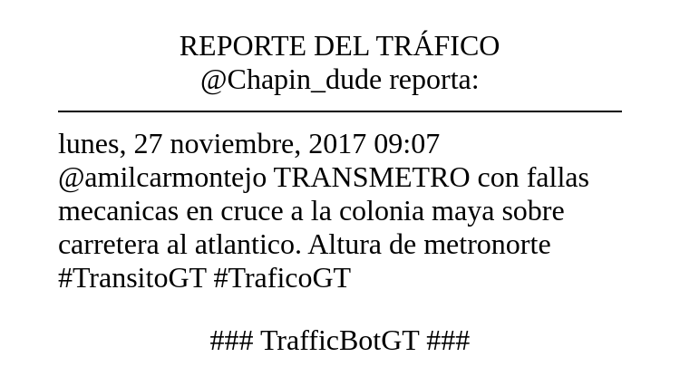
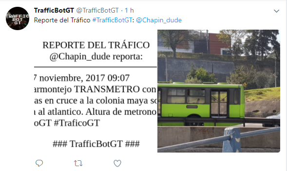

# TrafficBotGT
A bot that follows the traffic reports of Guatemala City on Twitter, inspired by @RealPressSecBot, @PressSecBotPlus and @guatebot. Follow TrafficBotGT on Twitter as [@TrafficBotGT](https://twitter.com/TrafficBotGT)

###Contents
1. [About](#about)
2. [Requirements](#requirements)
3. [Installation](#installation)
4. [Configuration](#configuration)
5. [Usage](#usage)
6. [License](#license)

## About
Inspired by [@realPressSecBot](https://twitter.com/realPressSecBot), [@PressSecBotPlus](https://github.com/valerybriz/PressSecBotPlus) and [@guatebot](https://twitter.com/guatebot). TrafficBotGT is a Python based Twitter bot that will reformat tweets by a specified hashtag into a press release image and publishes to Twitter. Optimized for python3.

### Improvements
- Python3
- Use of the Twitter Streaming API for real-time updates
- Follow specific words and hashtags

### To-do list
- Clickable links
- Inline Twitter full name expansion
- Quoted tweet formatting

### Samples

## Requirements
- A Twitter API key, and an account from which to publish tweets
- Python 3 (compatible with Python 2.7)
- [python-twitter](https://github.com/bear/python-twitter)
- wkhtmltoimage, part of [wkhtmltopdf](https://wkhtmltopdf.org/)
- [Jinja2](http://jinja.pocoo.org)
- [Pillow](https://python-pillow.org)

## Installation
1. Install the requirements:
    - [Download wkhtmltopdf][], or install from your package manager
    - `pip install python-twitter Jinja2 Pillow` (`easy_install` also works)
    - `pip3 install python-twitter Jinja2 Pillow` (for python3)
2. [Download the source][source] and unzip it (or clone the repository locally)
3. Set up a Twitter app
    - Follow the [Python-twitter instructions][app-keys] to create an app and get your API keys and access tokens
    - If you want to register your app with a different account than the one your bot will tweet from, use the [`get_access_token.py`][token] script to get the access tokens for the bot's account
4. Change the values in `twitter_token.conf` and configure per the [Configuration section](#configuration)

[download wkhtmltopdf]: https://wkhtmltopdf.org/downloads.html
[source]: https://github.com/robmathers/PressSecBotPlus/archive/master.zip
[app-keys]: https://python-twitter.readthedocs.io/en/latest/getting_started.html
[token]: https://github.com/bear/python-twitter/blob/master/get_access_token.py

## Configuration
### Twitter API & accounts
In the `settings` section of `twitter_token.conf`:

- Enter the words or hashtags you wish to create releases for. (`words_to_track = #TraficoGT,#TransitoGT`)
- Enter the text you wish to prefix each tweet with (no quotes necessary); to have no text, delete the placeholder or the whole line (`message = TWEET_STATUS_TEXT_HERE`)

In the `twitter_api` section, enter your Twitter API credentials as labelled.

## Usage
Run TrafficBotGT with `python3 TrafficBot.py` , or first mark it as executable with `chmod +x TrafficBot.py`, then run `./TrafficBot.py`.

When run, TrafficBot wait for any tweets that contains the words to track. It will then check real time for new tweets, until you quit.

### Running as a daemon process
As TrafficBotGT is intended to publish an ongoing stream of tweets, it is recommended that you run it as a daemon process. The best way of doing this will vary by OS. [Systemd for Ubuntu], [Launchd for MacOS][], or [rc.d for FreeBSD][] are suggested. Be careful to set the working directory to wherever `TrafficBot.py` is, as it expects other resources to be installed there.

[systemd for ubuntu]: https://wiki.ubuntu.com/SystemdForUpstartUsers
[launchd for macos]: https://alvinalexander.com/mac-os-x/mac-osx-startup-crontab-launchd-jobs
[rc.d for freebsd]: https://www.freebsd.org/doc/en/articles/rc-scripting/rcng-daemon.html

Alternatively, you can run it as a background process using `screen` or similar.

## License
PressSecBotPlus is Copyright © 2017 by Rob Mathers and licensed under the MIT license. You may do what you like with the software, but must include the [license and copyright notice](https://github.com/robmathers/PressSecBotPlus/blob/master/LICENSE.txt).

guatebot is Copyright © 2017 by valerybriz and licensed under the GNU General Public License v3.0. You may do what you like with the software, but must include the [license and copyright notice](https://github.com/valerybriz/guatebot/blob/master/LICENSE). 

### jQueryEmoji license
[jQueryEmoji](https://github.com/rodrigopolo/jqueryemoji) is used in this code and is Copyright (c) by Rodrigo Polo and licensed under the MIT License.
